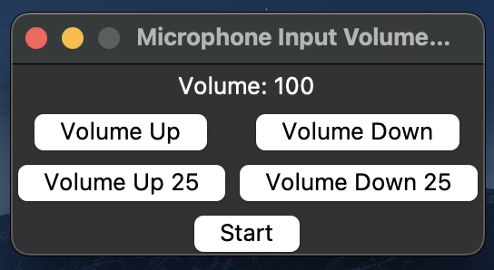

### Run on Terminal
- `git clone https://github.com/alameddinc/macos-autogain-freezer.git`
- `cd macos-autogain-freezer`
- `cd dist`
- `./main`

### Run on Finder
- Download files as zip from github
- Unzip it
- Enter to dist folder,
- Run main file 

### Screenshot
